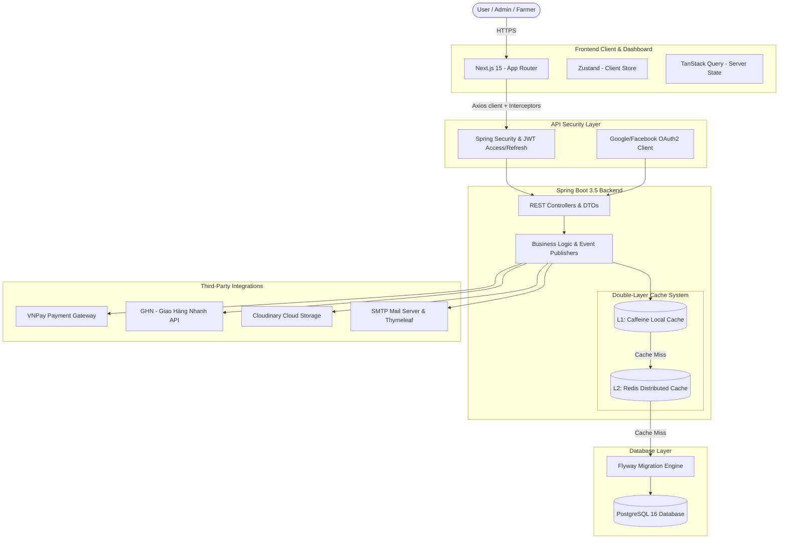

# 🍍 Pineapple E-Commerce — Organic Agriculture Platform

[](https://spring.io/projects/spring-boot)
[](https://nextjs.org/)
[](https://www.postgresql.org/)
[](https://redis.io/)
[](https://www.docker.com/)

**Pineapple E-Commerce** is a specialized e-commerce platform for organic agricultural products, directly connecting green farms (**Farmers**) with consumers (**Customers**) through a centralized administrative dashboard (**Admin**).

The system is built on a **Modular Monolith** architecture featuring multi-layered security protocols, high-performance L1/L2 caching, and a modern interactive analytics dashboard. It represents a fully production-ready, full-stack application.

---

## 🏗️ System Architecture

The application runs on a optimized Client-Server model with the following structural layout:



---

## 🛠️ Technology Stack

### 1. Backend API Service
*   **Core Framework:** Java 21 & Spring Boot 3.5.7
*   **Security:** Spring Security, JWT (JJWT), OAuth2 Client (Google & Facebook)
*   **Database & Migration:** PostgreSQL 16 & Flyway Database Migration
*   **Caching Strategy:** Spring Cache Abstraction with **Caffeine** (L1 - Local Cache) and **Redis** (L2 - Distributed Cache)
*   **File Storage:** Cloudinary Cloud Storage Integration
*   **Mailing System:** Spring Mail, Thymeleaf HTML Email Templates & Spring Retry (for resilience)
*   **Payment Integration:** Cổng thanh toán quốc gia VNPay (featuring Secure Hash encryption and background IPN callbacks)
*   **Utilities:** MapStruct (Compile-time high-performance mapping), Lombok, Apache POI (Excel reports), Springdoc OpenAPI/Swagger (automated API docs)

### 2. Frontend & Admin Dashboard
*   **Core Framework:** Next.js 15 (App Router, Standalone Build Mode)
*   **Language:** TypeScript (Strict mode)
*   **State Management:** TanStack Query v5 (Server-side Cache/Sync) & Zustand v5 (Client-side lightweight Store)
*   **Form & Validation:** React Hook Form v7 & Zod v3 Schema Validation
*   **Styling:** TailwindCSS v4 & shadcn/ui Design Tokens
*   **UI Components:** TanStack Table v8 (Data Table), Recharts v2 (Revenue, order, and inventory charts), Framer Motion v11 (smooth spring animations)
*   **Testing Suite:** Vitest v2 (Unit/Component Testing) & Playwright v1.49 (End-to-End Testing)

---

## 🌟 Key Features

1.  **Hybrid Authentication System:**
    *   Local authentication with email OTP verification for activating new accounts.
    *   OAuth2 login (Google, Facebook) with a background token exchange workflow to prevent token exposure in client-side URL history.
    *   **Silent Token Refresh:** Rotation flow utilizing secure HttpOnly, SameSite, and Secure cookies for Refresh Tokens to protect against XSS/CSRF attacks.
2.  **Organic Farmers Portal:**
    *   Farmers submit registration details and organic certifications for review. Admins approve/reject with feedback.
    *   Farmers manage catalog listings, record inventory batches with manufacturing/expiration dates, and document stock adjustments.
3.  **Smart Merge Cart:**
    *   Carts are initially stored in local storage for guest visitors.
    *   Upon login, the guest cart is merged with the database cart. The system validates inventory levels (`validate-stock`). Any items that are out of stock or disabled are skipped, and the user is notified.
4.  **Secure VNPay Integration:**
    *   Generates time-bound VNPay transaction URLs secured with SHA-512 signatures.
    *   Uses VNPay's IPN callback system directly hitting the backend to update order statuses securely, preventing client-side spoofing.
5.  **Dynamic Shipping Calculator:**
    *   Synchronized with GHN (Giao Hàng Nhanh) APIs for provinces, districts, and wards.
    *   Calculates shipping fees in real-time based on weight, dimensions, and geographical distance.
6.  **Reporting & Excel Export:**
    *   Dashboard featuring Area charts (Revenue), Pie charts (Order status), and Bar charts (Inventory levels).
    *   Exports warehouse records to Excel using Apache POI, with automatic color-coding warnings for near-expiry batches.

---

## 💾 Database Schema Overview (PostgreSQL & Flyway)

The database schema is organized to manage relationships cleanly and versioned automatically using Flyway:

*   **Security & Identity:** `users`, `roles`, `user_roles`, `refresh_tokens`, `otp_tokens`.
*   **Farm Management:** `farms` (1-to-1 relationship with the farmer user).
*   **Product Catalog:** `products`, `categories`, `product_images`.
*   **Inventory & Batches:** `inventory_batches` (FIFO lifecycle), `stock_adjustments` (losses, damages).
*   **Cart & Wishlist:** `carts`, `cart_items`, `wishlists`.
*   **Orders & Shipments:** `orders`, `order_items`, `shipments`, `addresses` (synced with GHN coordinates).
*   **Billing & Payments:** `payments` (retaining VNPay metadata).
*   **Interaction:** `reviews`, `review_images`, `review_votes` (community helpfulness voting).
*   **Marketing:** `coupons`, `coupon_applicable_products`, `coupon_applicable_categories`, `coupon_usages` (usage limit constraints).

---

## ⚡ Quick Start (Docker Compose)

The project includes preconfigured Docker setups for both services. You can boot the entire system with one command.

### Prerequisites
*   Docker & Docker Compose installed.
*   An active SMTP email account (Gmail App Password) and Cloudinary/VNPay sandbox credentials (optional for testing related workflows).

### Steps to Run
1.  **Clone the Repository:**
    ```bash
    git clone https://github.com/TDKhoa2712/Pineapple_E-Commerce.git
    cd Pineapple_E-Commerce
    ```

2.  **Configure Environment Variables:**
    *   Copy and set up the Backend `.env` file:
        ```bash
        cp backend/.env.example backend/.env
        ```
    *   Copy and set up the Frontend `.env.local` file:
        ```bash
        cp frontend/.env.local.example frontend/.env.local
        ```

3.  **Boot Up Docks:**
    In the root directory, run:
    ```bash
    docker-compose up -d --build
    ```
    *This starts:*
    *   **PostgreSQL 16** on port `5432`
    *   **pgAdmin 4** (Database visual client) on port `5050`
    *   **Redis 7** on port `6379`
    *   **Spring Boot Backend** on port `8080` (API endpoint: `http://localhost:8080/api/v1`)
    *   **Next.js Frontend** on port `3000` (Access at: `http://localhost:3000`)

4.  **Service Access:**
    *   **Storefront & Admin Panels:** [http://localhost:3000](http://localhost:3000)
    *   **Swagger API Documentation:** [http://localhost:8080/swagger-ui.html](http://localhost:8080/swagger-ui.html)
    *   **Database Management (pgAdmin):** [http://localhost:5050](http://localhost:5050) (Login: `admin@pineapple.com` / `admin`)

5.  **Shutdown:**
    ```bash
    docker-compose down
    ```

---

## 💎 Technical Architecture Highlights

*   **Multi-Layer Caching Strategy:** Reduces database read load by approximately 85%. L1 (Caffeine Cache in JVM memory) handles static config and categories for sub-millisecond lookups. L2 (Distributed Redis Cache) stores active product information and cart sessions to maintain data consistency across containerized application replicas.
*   **Optimized Standalone Builds:**
    *   **Backend:** Leverages Docker multi-stage builds with Eclipse Temurin Alpine JRE, running under a non-root system user `spring:spring`. JVM parameters are tuned (`MaxRAMPercentage=75.0`, `ActiveProcessorCount=1`) to prevent container memory limit breaches on memory-constrained hosting.
    *   **Frontend:** The Next.js 15 build is configured for `standalone` output. This strips out unused development dependencies, reducing the final Docker image footprint from ~1.2GB down to under **180MB**.
*   **Query Optimization:** Employs composite database indexes on dynamic search fields (e.g., `idx_products_category_status` for category and status-based querying) reducing database execution times during catalog searches.

---

## 📁 Sub-System Documentation
*   **Backend Details:** [backend/README.md](file:///d:/Self_Study/Java/Project_CV/Pineapple_E-commerce/backend/README.md)
*   **Frontend Details:** [frontend/README.md](file:///d:/Self_Study/Java/Project_CV/Pineapple_E-commerce/frontend/README.md)
