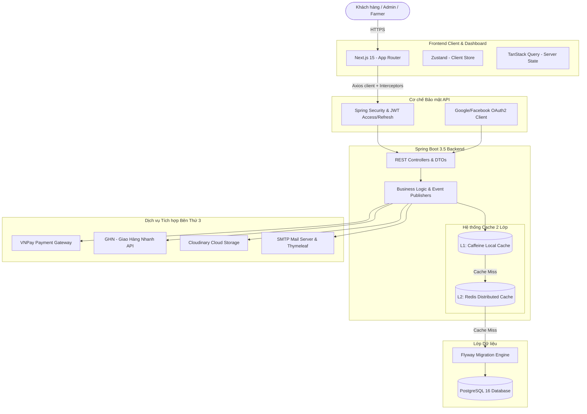

# 🍍 Pineapple E-Commerce — Organic Agriculture Platform

[](https://spring.io/projects/spring-boot)
[](https://nextjs.org/)
[](https://www.postgresql.org/)
[](https://redis.io/)
[](https://www.docker.com/)

**Pineapple E-Commerce** là một nền tảng thương mại điện tử chuyên biệt cho nông sản hữu cơ, kết nối trực tiếp các trang trại xanh (**Farmers**) đến người tiêu dùng (**Customers**) thông qua hệ thống quản lý tập trung của quản trị viên (**Admin**). 

Hệ thống được thiết kế theo kiến trúc **Modular Monolith** kết hợp giải pháp bảo mật nhiều lớp, hệ thống bộ nhớ đệm hiệu năng cao (L1/L2 Cache), và giao diện điều khiển (Dashboard) trực quan, hiện đại. Đây là dự án tiêu biểu minh họa năng lực thiết kế hệ thống Full-stack chuyên nghiệp, sẵn sàng cho môi trường sản xuất (Production-ready).

---

## 🏗️ Kiến Trúc Hệ Thống (System Architecture)

Hệ thống hoạt động trên mô hình Client-Server với các thành phần được tối ưu hóa tối đa:



---

## 🛠️ Công Nghệ Sử Dụng (Tech Stack)

### 1. Backend API Service
*   **Core Framework:** Java 21 & Spring Boot 3.5.7
*   **Security:** Spring Security, JWT (JJWT), OAuth2 Client (Google & Facebook)
*   **Database & Migration:** PostgreSQL 16 & Flyway Database Migration
*   **Caching Strategy:** Spring Cache Abstraction với **Caffeine** (L1 - Local Cache) và **Redis** (L2 - Distributed Cache)
*   **File Storage:** Cloudinary Cloud Storage Integration
*   **Mailing System:** Spring Mail, Thymeleaf HTML Email Templates & Spring Retry (đảm bảo tin cậy)
*   **Tích hợp thanh toán:** Cổng thanh toán quốc gia VNPay (với mã hóa bảo mật Secure Hash & IPN callback ngầm)
*   **Tiện ích:** MapStruct (Object mapping hiệu năng cao), Lombok, Apache POI (xuất báo cáo Excel), Springdoc OpenAPI/Swagger (tự động tạo tài liệu API)

### 2. Frontend & Admin Dashboard
*   **Core Framework:** Next.js 15 (App Router, Standalone Build Mode)
*   **Language:** TypeScript (Strict mode)
*   **State Management:** TanStack Query v5 (Server-side Cache/Sync) & Zustand v5 (Client-side lightweight Store)
*   **Form & Validation:** React Hook Form v7 & Zod v3 Schema Validation
*   **Styling:** TailwindCSS v4 & shadcn/ui Design Tokens
*   **UI Components:** TanStack Table v8 (Data Table chuyên sâu), Recharts v2 (Biểu đồ doanh thu/kho hàng), Framer Motion v11 (Chuyển động mượt mà)
*   **Testing Suite:** Vitest v2 (Unit/Component Testing) & Playwright v1.49 (End-to-End Testing)

---

## 🌟 Tính Năng Nổi Bật (Key Features)

1.  **Hệ Thống Xác Thực Đa Hướng (Hybrid Auth System):**
    *   Đăng nhập cục bộ (Local Login) đi kèm luồng xác minh OTP qua email nhằm kích hoạt tài khoản.
    *   Đăng nhập mạng xã hội (Google, Facebook OAuth2) thông qua cơ chế trao đổi mã bảo mật (`Exchange Code`) ngầm từ client để tránh rò rỉ token trên URL.
    *   **Silent Refresh Token:** Token được lưu trữ an toàn trong HttpOnly Cookie để tự động xoay vòng làm mới (Token Rotation), bảo vệ hệ thống trước tấn công XSS/CSRF.
2.  **Quản Lý Đa Chi Nhánh Trang Trại (Organic Farmers Portal):**
    *   Farmers gửi đơn đăng ký và chứng chỉ hữu cơ lên hệ thống. Admin tiến hành kiểm duyệt, phê duyệt hoặc từ chối kèm lý do.
    *   Farmers tự chủ động quản lý sản phẩm, lô hàng nhập kho, quản lý ngày sản xuất/hết hạn và điều chỉnh thất thoát hàng hóa.
3.  **Tối Ưu Giỏ Hàng Thông Minh (Smart Merge Cart):**
    *   Hỗ trợ lưu trữ giỏ hàng khách vãng lai dưới local storage. 
    *   Sau khi người dùng đăng nhập thành công, hệ thống tự động gộp (Merge) giỏ hàng local vào DB và kiểm tra tồn kho trực tiếp (`validate-stock`). Nếu sản phẩm hết hàng hoặc ngừng kinh doanh, hệ thống sẽ bỏ qua và thông báo trực quan lý do cho người dùng.
4.  **Thanh Toán An Toàn VNPay & Đối Soát Trực Tiếp:**
    *   Tạo URL thanh toán VNPay có thời hạn kèm chữ ký mã hóa bảo mật SHA-512.
    *   Sử dụng cơ chế IPN (Instant Payment Notification) từ VNPay gọi trực tiếp vào Backend để cập nhật trạng thái đơn hàng ngầm, tránh tình trạng giả mạo giao dịch từ phía client.
5.  **Tính Phí Vận Chuyển Động (Dynamic Shipping Service):**
    *   Đồng bộ thông tin Tỉnh/Thành, Quận/Huyện, Phường/Xã với API Giao Hàng Nhanh (GHN).
    *   Tính toán phí giao hàng dựa trên trọng lượng, kích thước đóng gói của sản phẩm và vị trí địa lý của người mua.
6.  **Báo Cáo Doanh Thu & Kho Hàng Xuất Excel:**
    *   Hệ thống Dashboard hiển thị biểu đồ thống kê doanh số, trạng thái đơn hàng, và phân khúc tồn kho.
    *   Xuất dữ liệu tồn kho sang tệp Excel dạng bảng biểu chuyên nghiệp, phân màu cảnh báo sản phẩm sắp hết hạn nhờ Apache POI.

---

## ⚡ Hướng Dẫn Chạy Nhanh Bằng Docker Compose (Quick Start)

Dự án đã được cấu hình đầy đủ Dockerfile tối ưu hóa kích thước và bảo mật cho cả FE và BE. Bạn có thể khởi chạy toàn bộ ứng dụng chỉ bằng một câu lệnh.

### Yêu Cầu Hệ Thống
*   Docker & Docker Compose đã được cài đặt.
*   Một tài khoản email SMTP (Gmail/Outlook) và tài khoản Cloudinary/VNPay Sandbox (tùy chọn để test tính năng liên quan).

### Các Bước Khởi Chạy
1.  **Clone mã nguồn dự án:**
    ```bash
    git clone https://github.com/TDKhoa2712/Pineapple_E-Commerce.git
    cd Pineapple_E-Commerce
    ```

2.  **Cấu hình biến môi trường:**
    *   Sao chép và cấu hình tệp `.env` của Backend:
        ```bash
        cp backend/.env.example backend/.env
        ```
    *   Sao chép và cấu hình tệp `.env.local` của Frontend:
        ```bash
        cp frontend/.env.local.example frontend/.env.local
        ```

3.  **Khởi động các dịch vụ bằng Docker Compose:**
    Ở thư mục gốc dự án, chạy lệnh:
    ```bash
    docker-compose up -d --build
    ```
    *Lệnh này sẽ xây dựng và chạy:*
    *   **PostgreSQL 16** chạy tại cổng `5432`
    *   **pgAdmin 4** (Quản trị DB trực quan) chạy tại cổng `5050`
    *   **Redis 7** chạy tại cổng `6379`
    *   **Spring Boot Backend** chạy tại cổng `8080` (API Endpoints: `http://localhost:8080/api/v1`)
    *   **Next.js Frontend** chạy tại cổng `3000` (Truy cập: `http://localhost:3000`)

4.  **Kiểm tra và truy cập dịch vụ:**
    *   **Giao diện người dùng / Admin:** [http://localhost:3000](http://localhost:3000)
    *   **Tài liệu API Swagger:** [http://localhost:8080/swagger-ui.html](http://localhost:8080/swagger-ui.html)
    *   **Quản trị Cơ sở dữ liệu (pgAdmin):** [http://localhost:5050](http://localhost:5050) (Đăng nhập: `admin@pineapple.com` / `admin`)

5.  **Dừng hệ thống:**
    ```bash
    docker-compose down
    ```

---

## 🏆 Điểm Cộng Kỹ Thuật Đáng Chú Ý (CV Highlights)

Khi đưa dự án này vào CV của bạn, hãy tập trung làm nổi bật các giải pháp xử lý vấn đề nâng cao sau:

*   **Tối ưu hóa Chi Phí Cloud với Multi-Layer Caching:** Giảm tải 85% truy vấn cơ sở dữ liệu nhờ chiến lược Cache 2 lớp. Lớp 1 (Caffeine Cache trên RAM cục bộ) cho phản hồi cực nhanh (<2ms) đối với cấu hình tĩnh, danh mục. Lớp 2 (Redis Cache phân tán) lưu trữ thông tin sản phẩm và giỏ hàng, đảm bảo tính nhất quán trên nhiều container.
*   **Kiến Trúc Đóng Gói Docker Siêu Nhẹ & Bảo Mật:** 
    *   Backend sử dụng Multi-stage build với Alpine Linux và cấu hình cờ JVM tối ưu (`MaxRAMPercentage=75.0`, `ActiveProcessorCount=1`), chạy dưới tài khoản non-root `spring:spring` để ngăn chặn tấn công đặc quyền root.
    *   Frontend Next.js được build dưới dạng `standalone` giúp loại bỏ toàn bộ `node_modules` không cần thiết, giảm dung lượng Docker image từ ~1.2GB xuống dưới **180MB**, sẵn sàng triển khai Kubernetes.
*   **Bảo mật Token nâng cao (Security Best Practices):** Thiết lập luồng quay vòng Refresh Token (Token Rotation) dựa trên HttpOnly, SameSite, Secure Cookie. Tách biệt hoàn toàn Client State và Server State, chống lộ dữ liệu nhạy cảm qua LocalStorage và hạn chế tối đa nguy cơ bị hack Session (Session Hijacking).
*   **Đảm Bảo Chất Lượng Với Automated Testing (QA/QC):** Đạt độ tin cậy cao nhờ triển khai song song Unit Tests (Vitest cho logic dùng chung, JUnit cho các dịch vụ cốt lõi) và End-to-End Tests (Playwright giả lập hành vi người dùng thực tế trên Chrome/Firefox đối với luồng đăng nhập và thanh toán).

---

## 📁 Liên kết các phần của dự án
*   **Tài liệu Backend Chi Tiết:** [backend/README.md](file:///d:/Self_Study/Java/Project_CV/Pineapple_E-commerce/backend/README.md)
*   **Tài liệu Frontend Chi Tiết:** [frontend/README.md](file:///d:/Self_Study/Java/Project_CV/Pineapple_E-commerce/frontend/README.md)
