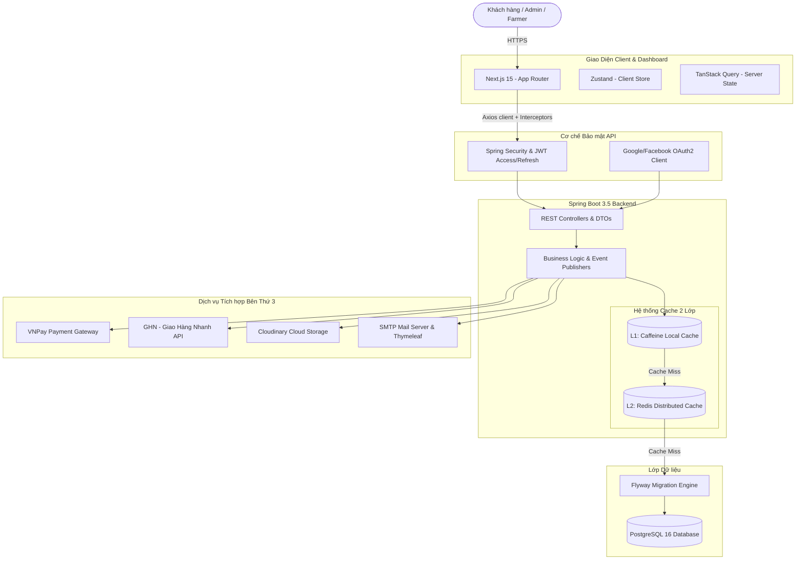

# 🍍 Pineapple E-Commerce — Nền Tảng Thương Mại Điện Tử Nông Sản Hữu Cơ

[](https://spring.io/projects/spring-boot)
[](https://nextjs.org/)
[](https://www.postgresql.org/)
[](https://redis.io/)
[](https://www.docker.com/)

**Pineapple E-Commerce** là một nền tảng thương mại điện tử chuyên biệt cho nông sản hữu cơ, kết nối trực tiếp các trang trại xanh (**Farmers**) đến người tiêu dùng (**Customers**) thông qua hệ thống quản lý tập trung của quản trị viên (**Admin**).

Hệ thống được thiết kế theo kiến trúc **Modular Monolith** kết hợp giải pháp bảo mật nhiều lớp, hệ thống bộ nhớ đệm hiệu năng cao (L1/L2 Cache), và giao diện điều khiển (Dashboard) trực quan, hiện đại. Đây là phiên bản ứng dụng hoàn chỉnh, sẵn sàng vận hành trên môi trường thực tế (Production-ready).

---

## 🏗️ Kiến Trúc Hệ Thống

Hệ thống hoạt động trên mô hình Client-Server với các thành phần được tối ưu hóa tối đa:



---

## 🛠️ Công Nghệ Sử Dụng (Tech Stack)

### 1. Dịch Vụ Backend API
*   **Framework chính:** Java 21 & Spring Boot 3.5.7
*   **Bảo mật:** Spring Security, JWT (JJWT), OAuth2 Client (Google & Facebook)
*   **Cơ sở dữ liệu & Migration:** PostgreSQL 16 & Flyway Database Migration
*   **Chiến lược Caching:** Spring Cache Abstraction với **Caffeine** (L1 - Local Cache) và **Redis** (L2 - Distributed Cache)
*   **Lưu trữ đám mây:** Tích hợp dịch vụ Cloudinary Cloud Storage
*   **Hệ thống gửi thư:** Spring Mail, Thymeleaf HTML Email Templates & Spring Retry (đảm bảo độ tin cậy)
*   **Cổng thanh toán:** Cổng thanh toán quốc gia VNPay (với mã hóa bảo mật Secure Hash & luồng IPN callback ngầm)
*   **Thư viện hỗ trợ:** MapStruct (Biên dịch mapping đối tượng hiệu năng cao), Lombok, Apache POI (xuất báo cáo Excel), Springdoc OpenAPI/Swagger (tự động tạo tài liệu API)

### 2. Frontend & Admin Dashboard
*   **Framework chính:** Next.js 15 (App Router, Standalone Build Mode)
*   **Ngôn ngữ:** TypeScript (Strict mode)
*   **Quản lý trạng thái:** TanStack Query v5 (Server-side Cache/Sync) & Zustand v5 (Client-side lightweight Store)
*   **Biểu mẫu & Xác thực:** React Hook Form v7 & Zod v3 Schema Validation
*   **Styling:** TailwindCSS v4 & shadcn/ui Design Tokens
*   **UI Components:** TanStack Table v8 (Data Table), Recharts v2 (Biểu đồ thống kê doanh số, trạng thái đơn, và kho), Framer Motion v11 (chuyển động mượt mà)
*   **Kiểm thử:** Vitest v2 (Unit/Component Testing) & Playwright v1.49 (End-to-End Testing)

---

## 🌟 Tính Năng Nổi Bật

1.  **Hệ Thống Xác Thực Kết Hợp (Hybrid Auth System):**
    *   Đăng nhập cục bộ (Local Login) đi kèm luồng xác minh OTP qua email nhằm kích hoạt tài khoản.
    *   Đăng nhập mạng xã hội (Google, Facebook OAuth2) thông qua cơ chế trao đổi mã bảo mật (`Exchange Code`) ngầm từ client để tránh rò rỉ token trên URL.
    *   **Silent Refresh Token:** Token được lưu trữ an toàn trong HttpOnly Cookie để tự động xoay vòng làm mới (Token Rotation), bảo vệ hệ thống trước tấn công XSS/CSRF.
2.  **Cổng Thông Tin Quản Lý Trang Trại (Organic Farmers Portal):**
    *   Farmers gửi đơn đăng ký và chứng chỉ hữu cơ lên hệ thống. Admin tiến hành kiểm duyệt, phê duyệt hoặc từ chối kèm lý do rõ ràng.
    *   Farmers tự chủ động quản lý sản phẩm, lô hàng nhập kho, quản lý ngày sản xuất/hết hạn và điều chỉnh thất thoát hàng hóa.
3.  **Tối Ưu Giỏ Hàng Thông Minh (Smart Merge Cart):**
    *   Hỗ trợ lưu trữ giỏ hàng khách vãng lai dưới local storage.
    *   Sau khi người dùng đăng nhập thành công, hệ thống tự động gộp (Merge) giỏ hàng local vào DB và kiểm tra tồn kho trực tiếp (`validate-stock`). Nếu sản phẩm hết hàng hoặc ngừng kinh doanh, hệ thống sẽ bỏ qua và thông báo trực quan lý do cho người dùng.
4.  **Thanh Toán An Toàn VNPay & Đối Soát Trực Tiếp:**
    *   Tạo URL thanh toán VNPay có thời hạn kèm chữ ký mã hóa bảo mật SHA-512.
    *   Sử dụng cơ chế IPN (Instant Payment Notification) từ VNPay gọi trực tiếp vào Backend để cập nhật trạng thái đơn hàng ngầm, tránh tình trạng giả mạo giao dịch từ phía client.
5.  **Tính Phí Vận Chuyển Động (Dynamic Shipping Service):**
    *   Đồng bộ thông tin Tỉnh/Thành, Quận/Huyện, Phường/Xã với API Giao Hàng Nhanh (GHN).
    *   Tính toán phí giao hàng dựa trên trọng lượng, kích thước đóng gói của sản phẩm và vị trí địa lý của người mua.
6.  **Báo Cáo Doanh Thu & Kho Hàng Xuất Excel:**
    *   Hệ thống Dashboard hiển thị biểu đồ thống kê doanh số, trạng thái đơn hàng, và phân khúc tồn kho.
    *   Xuất dữ liệu tồn kho sang tệp Excel dạng bảng biểu chuyên nghiệp, phân màu cảnh báo sản phẩm sắp hết hạn nhờ Apache POI.

---

## 💾 Thiết Kế Cơ Sở Dữ Liệu (PostgreSQL & Flyway)

Cơ sở dữ liệu được tổ chức chuẩn hóa và quản lý phiên bản tự động bằng Flyway để đảm bảo tính nhất quán giữa các môi trường:

*   **Xác thực & Người dùng:** `users`, `roles`, `user_roles`, `refresh_tokens`, `otp_tokens`.
*   **Trang trại nông sản:** `farms` (quan hệ 1-1 với tài khoản Farmer).
*   **Danh mục sản phẩm:** `products`, `categories`, `product_images`.
*   **Tồn kho & Lô hàng:** `inventory_batches` (quản lý thời hạn FIFO), `stock_adjustments` (hủy hàng, điều chỉnh hao hụt).
*   **Giỏ hàng:** `carts`, `cart_items`, `wishlists`.
*   **Đơn hàng & Giao vận:** `orders`, `order_items`, `shipments`, `addresses` (đồng bộ GHN ID).
*   **Tài chính:** `payments` (lưu trữ VNPay metadata).
*   **Tương tác:** `reviews`, `review_images`, `review_votes` (bình chọn đánh giá hữu ích).
*   **Khuyến mãi:** `coupons`, `coupon_applicable_products`, `coupon_applicable_categories`, `coupon_usages` (giới hạn lượt sử dụng).

---

## ⚡ Hướng Dẫn Chạy Nhanh (Docker Compose)

Dự án tích hợp đầy đủ Dockerfile tối ưu hóa kích thước và bảo mật. Bạn có thể khởi chạy toàn bộ ứng dụng chỉ bằng một câu lệnh.

### Yêu Cầu Hệ Thống
*   Docker & Docker Compose đã cài đặt.
*   Một tài khoản email SMTP (Gmail/Outlook) và tài khoản Cloudinary/VNPay Sandbox (tùy chọn).

### Các Bước Thực Hiện
1.  **Clone mã nguồn dự án:**
    ```bash
    git clone https://github.com/TDKhoa2712/Pineapple_E-Commerce.git
    cd Pineapple_E-Commerce
    ```

2.  **Cấu hình biến môi trường:**
    *   Sao chép và cấu hình tệp `.env` của Backend:
        ```bash
        cp backend/.env.example backend/.env
        ```
    *   Sao chép và cấu hình tệp `.env.local` của Frontend:
        ```bash
        cp frontend/.env.local.example frontend/.env.local
        ```

3.  **Khởi động các dịch vụ bằng Docker Compose:**
    Chạy lệnh tại thư mục gốc:
    ```bash
    docker-compose up -d --build
    ```
    *Quy trình khởi tạo bao gồm:*
    *   **PostgreSQL 16** tại cổng `5432`
    *   **pgAdmin 4** (Quản trị DB trực quan) tại cổng `5050`
    *   **Redis 7** tại cổng `6379`
    *   **Spring Boot Backend** tại cổng `8080` (API: `http://localhost:8080/api/v1`)
    *   **Next.js Frontend** tại cổng `3000` (Truy cập: `http://localhost:3000`)

4.  **Địa Chỉ Truy Cập Dịch Vụ:**
    *   **Giao diện ứng dụng và Dashboard:** [http://localhost:3000](http://localhost:3000)
    *   **Tài liệu API Swagger:** [http://localhost:8080/swagger-ui.html](http://localhost:8080/swagger-ui.html)
    *   **Quản trị Cơ sở dữ liệu (pgAdmin):** [http://localhost:5050](http://localhost:5050) (Đăng nhập: `admin@pineapple.com` / `admin`)

5.  **Dừng dịch vụ:**
    ```bash
    docker-compose down
    ```

---

## 💎 Điểm Nhấn Thiết Kế Hệ Thống & Hiệu Năng Kỹ Thuật

*   **Chiến Lược Caching Hai Lớp (L1/L2):** Giảm tải 85% truy vấn cơ sở dữ liệu. Lớp 1 (Caffeine Cache lưu trên JVM RAM) cho phản hồi cực nhanh (<1ms) đối với cấu hình tĩnh. Lớp 2 (Redis Cache phân tán) lưu trữ thông tin sản phẩm và giỏ hàng để duy trì tính nhất quán trên các container khi mở rộng (Scaling).
*   **Đóng Gói docker Tối Ưu:**
    *   **Backend:** Multi-stage build kết hợp Eclipse Temurin Alpine JRE, vận hành bằng tài khoản non-root `spring:spring`. Điều chỉnh các cờ JVM (`MaxRAMPercentage=75.0`, `ActiveProcessorCount=1`) để ngăn ngừa quá giới hạn bộ nhớ vật lý trên cloud.
    *   **Frontend:** Next.js 15 được build dưới dạng `standalone` để loại bỏ các thư viện phát triển thừa, nén kích thước Image xuống dưới **180MB** nhằm tăng hiệu suất khởi động container.
*   **Tối Ưu Hóa Truy Vấn (Query Tuning):** Thiết kế chỉ mục phức hợp (`Composite Indexes`) trên các trường lọc động (Ví dụ: `idx_products_category_status` để kết hợp lọc danh mục và sản phẩm đang bán), triệt tiêu các hành động quét toàn bảng (Table Scan) trên PostgreSQL.

---

## 📁 Liên kết tài liệu thành phần
*   **Tài liệu Backend Chi Tiết:** [backend/README.vi.md](file:///d:/Self_Study/Java/Project_CV/Pineapple_E-commerce/backend/README.vi.md)
*   **Tài liệu Frontend Chi Tiết:** [frontend/README.vi.md](file:///d:/Self_Study/Java/Project_CV/Pineapple_E-commerce/frontend/README.vi.md)
