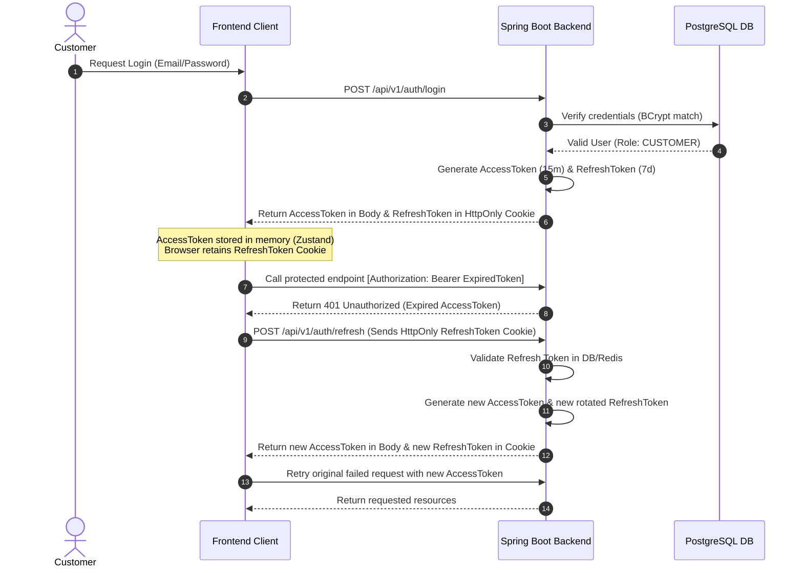

# 🍍 Pineapple E-Commerce — Spring Boot Backend Service

[](https://openjdk.org/projects/jdk/21/)
[](https://spring.io/projects/spring-boot)
[](https://flywaydb.org/)
[](https://swagger.io/)

This document outlines the source code architecture, database designs, core system workflows, and installation instructions for the **Backend API Service** of the Pineapple E-Commerce system.

---

## 🛠️ Technology Stack

*   **Language & Runtime:** Java 21 (LTS) & Eclipse Temurin JRE.
*   **Core Framework:** Spring Boot 3.5.7 (Spring Web, Spring Data JPA, Spring Security, Spring Mail, Spring Cache, Spring AOP).
*   **Databases:** PostgreSQL 16 (Primary relational DBMS) & Redis 7 (Distributed caching and token management).
*   **Security:** JSON Web Token (JJWT 0.12.6) & Spring Security OAuth2 Client.
*   **Schema Migration:** Flyway Core (Automatic database versioning).
*   **Local Caching:** Caffeine Cache (L1 high-performance local cache).
*   **Integrations & Libraries:**
    *   **Cloudinary SDK:** Cloud-based media storage for products and avatars.
    *   **Apache POI 5.3.0:** Excel workbook read/write library for inventory reports.
    *   **Spring Retry:** Retry mechanisms for volatile SMTP and external network connections.
    *   **MapStruct 1.6.3:** Compile-time object mapping utility for DTO-Entity translations.
    *   **Lombok & Springdoc OpenAPI v2:** Boilerplate reduction and automated Swagger UI generation.

---

## 📁 Package & Directory Structure

The backend employs a **Modular Monolith** structure, utilizing layered architectural patterns within each isolated module to ensure decoupling and maintainability:

```
backend/src/main/java/backend/pineapple_ecommerce/
├── PineappleEcommerceApplication.java  # Main application starter
│
├── common/                             # Shared utility components
│   ├── exception/                      # GlobalExceptionHandler & Custom Exceptions
│   ├── validation/                     # Custom validation constraint annotations
│   └── response/                       # Standard API response wrapper (ApiResponse)
│
├── security/                           # Spring Security & JWT configurations
│   ├── config/                         # SecurityFilterChain, CORS & Password Encoder
│   ├── jwt/                            # JwtTokenProvider & JwtAuthenticationFilter
│   └── oauth2/                         # CustomOAuth2UserService & OAuth2SuccessHandler
│
├── infrastructure/                     # Environment configuration & integrations
│   ├── config/                         # CacheConfig, RedisConfig, AsyncConfig, CloudinaryConfig
│   └── integration/                    # External API Clients (GHN, VNPay)
│
├── event/                              # Asynchronous Event-Driven Messaging
│   ├── publisher/                      # Publishers emitting transactional events
│   └── listener/                       # Listeners executing tasks (OTP dispatch, audit logs)
│
└── modules/                            # Isolated Domain Modules
    ├── auth/                           # Authentication, OTP registration, and OAuth2 exchanges
    ├── user/                           # User management, profile settings, and RBAC
    ├── product/                        # Catalog categorization, product attributes, and search filters
    ├── farm/                           # Farm applications, business metadata, and approvals
    ├── cart/                           # Shopping cart persistence, syncing, and validations
    ├── address/                        # Delivery addresses synced with carrier coordinates (GHN)
    ├── shipping/                       # Dynamic shipping fees and carriers tracking
    ├── coupon/                         # Marketing coupons, validation, and usage limits
    ├── order/                          # Order placement, checkout, and cancellation lifecycles
    ├── payment/                        # VNPay gateway execution and IPN handler
    ├── review/                         # Verified-purchase ratings and reviews moderation
    ├── wishlist/                       # Product wishlist collections
    └── inventory/                      # Batches (FIFO), adjustments, and Excel reports
```

---

## 💾 Database Design & Schema Migrations (Flyway)

The PostgreSQL 16 schema is structured for transactional integrity and migrated using Flyway versioned scripts:

### 1. Flyway Migration Version History
*   **`V1__init_schema.sql`:** Initializes the primary database schema including 26 tables representing all modules (`users`, `farms`, `products`, `orders`, `inventory_batches`, etc.).
*   **`V2__add_coupon_code_to_orders.sql`:** Appends `coupon_code` to the `orders` table to trace applied discounts. Adds a conditional index `idx_orders_coupon_code` to improve order lookup queries.
*   **`V3__extend_farm_status_workflow.sql`:** Alters the `farms` check constraints to accommodate advanced administrative verification states.
*   **`V4__inventory_batches_farmer_approval_workflow.sql`:** Introduces a `rejection_reason` column to `inventory_batches` allowing administrators to document quality issues for rejected batches.
*   **`V5__products_status_reason_and_workflow.sql`:** Appends `status_reason` to `products` to store moderation reasoning for products disabled by administrative reviews.
*   **`V6__add_performance_indexes.sql`:** Implements critical indexes targeting bottlenecks identified under load testing.
*   **`V7__add_unit_to_products.sql`:** Adds a measurement `unit` column to `products` (defaulting existing records to `'kg'`).

### 2. High-Traffic Index Optimizations
To preserve sub-second response times under peak request volumes, the database implements custom indexes:
*   **`idx_inventory_batches_expiry_status`** on `inventory_batches (expiry_date, status)`: Accelerates automated scheduler tasks that scan for and mark expired inventory batches.
*   **`idx_orders_user_id`** on `orders (user_id)`: Enhances join performance and optimizes user purchase history retrieval.
*   **`idx_products_category_status`** on `products (category_id, status)`: Speeds up customer searches by indexing product listings filtered by categories combined with active status.

---

## 🔄 Core Domain Workflows

### 1. Farmer Registration & Moderation (Farms Lifecycle)
A farm must go through administrative auditing before listing products on the storefront:
```
[New Registration] ──> PENDING_APPROVAL (Pending certification review)
                              │
             ┌────────────────┴────────────────┐
             ▼                                 ▼
       ACTIVE (Approved)               REJECTED (Denied with feedback)
             │
             ▼
       PENDING_DEACTIVATION (Voluntary closure request)
             │
             ▼
       INACTIVE (Closed) ──> PENDING_REACTIVATION (Reopening request) ──> ACTIVE
```

### 2. Expiration-Aware Stock Allocation (Inventory Batches Lifecycle)
Fresh organic produce has short lifecycles, and is tracked dynamically via inventory batches:
*   **`PENDING_APPROVAL`:** Newly declared farm batch waiting for quality reviews.
*   **`AVAILABLE`:** Certified batch currently active on the catalog.
*   **`REJECTED`:** Batch failed to meet organic standards or has labeling errors.
*   **`SOLD_OUT`:** Batch quantity reduced to 0 by FIFO checkouts.
*   **`EXPIRED`:** Expiration date exceeded. Automatically moved to this state by background cron schedulers.

### 3. Catalog Lifecycle (Products Lifecycle)
Products shift through states: `ACTIVE` (discoverable and purchasable) -> `PENDING_DEACTIVATION` (scheduled for disablement once active batches deplete) -> `INACTIVE` (hidden from storefront) | `OUT_OF_STOCK` (all related batches depleted).

---

## 🔐 Core Technical Implementations

### 1. Hybrid Authentication & Silent Token Rotation
The security configuration protects sessions from Cross-Site Scripting (XSS) and Cross-Site Request Forgery (CSRF) via a dual-token mechanism:
*   **Access Token (JWT):** Short-lived (15 minutes), returned in the JSON payload, and stored in Frontend client RAM. Passed via `Authorization: Bearer <accessToken>` headers.
*   **Refresh Token (JWT):** Long-lived (7 days), stored in the browser as a secure cookie with: `HttpOnly` (inaccessible to JS scripts), `Secure` (transmitted only over HTTPS), and `SameSite=Lax` (safeguarded against CSRF).
*   **Silent Refresh:** When the Access Token expires, Axios interceptors issue a silent request to `POST /api/v1/auth/refresh` sending the cookie. The backend verifies the token and issues a new pair, rotating the Refresh Token cookie.



### 2. Multi-Layer Caching (L1 Caffeine + L2 Redis)
Designed to minimize read latency and database query loads:
*   **L1 Cache (Caffeine):** In-memory JVM cache. Stores static, high-read configurations (e.g., provinces, categories tree) with sub-millisecond retrieval.
*   **L2 Cache (Redis):** Distributed external cache. Retains active product listings and cart counts. Keeps cache consistent across multiple scaled instances.
*   **Eviction:** Controlled via `@Cacheable`, `@CachePut`, and `@CacheEvict` annotations triggered by administrative updates.

### 3. Securing VNPay Payments (IPN Validation)
Prevents billing vulnerabilities by ignoring status parameters on client redirects:
*   **URL Initialization:** Backend calculates the request signature `vnp_SecureHash` using HMAC-SHA512 with `vnp_HashSecret` before generating the gateway URL.
*   **IPN (Instant Payment Notification):** Upon completing the payment, VNPay routes an IPN callback directly to the backend (`GET /api/v1/payments/vnpay-ipn`).
*   **Verification Steps:**
    1.  Verifies the IPN HMAC-SHA512 signature against the secret hash.
    2.  Validates the transaction amount (`vnp_Amount`) matches the recorded order cost.
    3.  Confirms order status is currently `PENDING`.
    4.  Updates database records to `PAID` and orders to `PROCESSING`, returning `RspCode: 00` to VNPay.

### 4. FIFO Inventory Allocation
*   Inventory is recorded under unique **Batches** mapping manufacture dates, costs, and expirations.
*   Checkouts automatically allocate items sequentially from the oldest batch (First-In, First-Out).
*   A Spring Scheduler scans for expired batches daily, transitioning their statuses to `EXPIRED`.

### 5. Resilient Event-Driven Mail System
*   Crucial operations (e.g., OTP dispatch, invoice PDF generation) publish transactional **Spring Events** asynchronous from the main request thread pool (`@Async`).
*   Emails are compiled using Thymeleaf template layouts.
*   The dispatcher utilizes `@Retryable` annotations configured for up to **3 attempts** using exponential backoff (starting at `2000ms`, multiplier `2.0`) to handle SMTP connection timeouts gracefully.

---

## ⚡ Setup & Run

### 1. Backend `.env` File
Create a `.env` file in the `/backend` folder:
```env
# Database Configuration
DB_HOST=localhost
DB_PORT=5432
DB_NAME=pineapple_ecommerce
DB_USER=postgres
DB_PASSWORD=your_postgres_password

# Redis Configuration
REDIS_HOST=localhost
REDIS_PORT=6379

# JWT Security Configurations
JWT_SECRET=your_super_secret_key_minimum_256_bits_length_for_hmac_sha256_algorithm
JWT_EXPIRATION_MS=900000        # 15 minutes (ms)
JWT_REFRESH_EXPIRATION_MS=604800000  # 7 days (ms)

# OAuth2 Provider Settings
GOOGLE_CLIENT_ID=your_google_client_id
GOOGLE_CLIENT_SECRET=your_google_client_secret
FACEBOOK_CLIENT_ID=your_facebook_client_id
FACEBOOK_CLIENT_SECRET=your_facebook_client_secret

# Cloud Services (Cloudinary Storage)
CLOUDINARY_CLOUD_NAME=your_cloudinary_name
CLOUDINARY_API_KEY=your_cloudinary_api_key
CLOUDINARY_API_SECRET=your_cloudinary_api_secret

# VNPay Integrations
VNPAY_TMN_CODE=your_vnpay_tmn_code
VNPAY_HASH_SECRET=your_vnpay_hash_secret
VNPAY_PAY_URL=https://sandbox.vnpayment.vn/paymentv2/vpcpay.html
VNPAY_RETURN_URL=http://localhost:3000/payment/result

# Mailing SMTP Server (Gmail App Password)
MAIL_HOST=smtp.gmail.com
MAIL_PORT=587
MAIL_USERNAME=your_email@gmail.com
MAIL_PASSWORD=your_gmail_app_password
```

### 2. Running Locally
*   **Step 1: Start PostgreSQL & Redis databases** (You can run these via the local `docker-compose.yml` file):
    ```bash
    docker-compose up -d postgres redis
    ```
*   **Step 2: Package using Maven**
    ```bash
    ./mvnw clean package -DskipTests
    ```
*   **Step 3: Launch the application**
    ```bash
    ./mvnw spring-boot:run
    ```
    The application runs Flyway schema scripts, inserts mock tables (`sample_test_data.sql`), and listens on port `8080`.

### 3. Docker Containerization
To package the app into a Docker Image:
```bash
docker build -t pineapple-backend:latest .
```
The Dockerfile uses multi-stage compiles to output a secure, minimal Eclipse Temurin JRE run container running under user `spring`.
