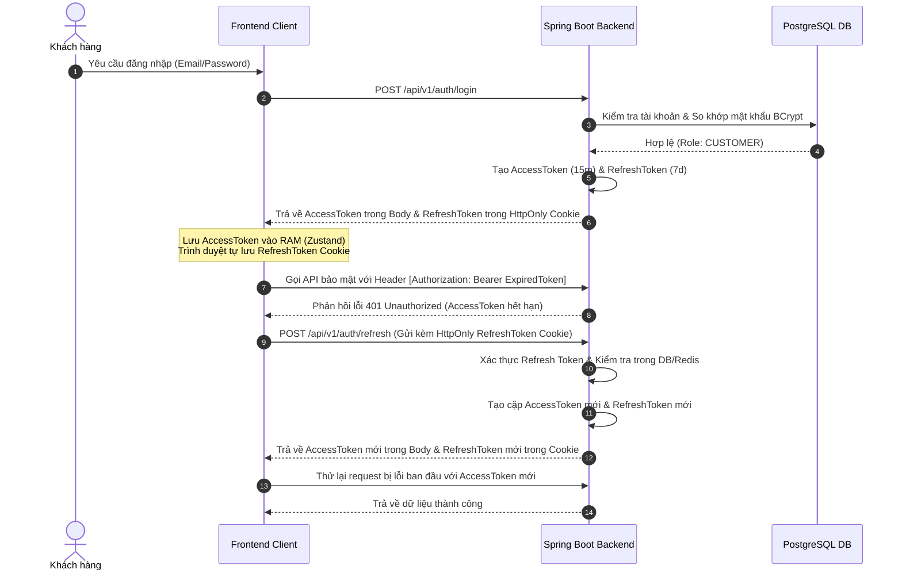

# 🍍 Pineapple E-Commerce — Spring Boot Backend Service

[](https://openjdk.org/projects/jdk/21/)
[](https://spring.io/projects/spring-boot)
[](https://flywaydb.org/)
[](https://swagger.io/)

Tài liệu này cung cấp cái nhìn chi tiết về kiến trúc mã nguồn, thiết kế hệ thống, cấu trúc cơ sở dữ liệu chi tiết, các giải pháp kỹ thuật nâng cao và hướng dẫn cài đặt chạy thử cho dịch vụ **Backend API** của hệ thống Pineapple E-Commerce.

---

## 🛠️ Công Nghệ và Thư Viện Sử Dụng (Technical Stack)

*   **Ngôn ngữ & Runtime:** Java 21 (LTS) & Eclipse Temurin JRE.
*   **Framework cốt lõi:** Spring Boot 3.5.7 (Spring Web, Spring Data JPA, Spring Security, Spring Mail, Spring Cache, Spring AOP).
*   **Cơ sở dữ liệu:** PostgreSQL 16 (Hệ quản trị CSDL quan hệ chính) & Redis 7 (Bộ nhớ đệm phân tán và quản lý session).
*   **Bảo mật:** JSON Web Token (JJWT 0.12.6) & Spring Security OAuth2 Client.
*   **Di chuyển dữ liệu:** Flyway Core (Quản lý phiên bản cơ sở dữ liệu tự động).
*   **Bộ nhớ đệm cục bộ:** Caffeine Cache (Lớp cache L1 tốc độ cao).
*   **Các thư viện tích hợp bổ sung:**
    *   **Cloudinary SDK:** Lưu trữ hình ảnh sản phẩm/avatar.
    *   **Apache POI 5.3.0:** Đọc/ghi và xuất báo cáo dữ liệu kho hàng dưới dạng file Excel.
    *   **Spring Retry:** Cơ chế thử lại tự động khi gửi email hoặc gọi API bên thứ 3 thất bại.
    *   **MapStruct 1.6.3:** Tự động tạo mã chuyển đổi giữa Entity và DTO ở thời gian biên dịch (Compile-time) nhằm tối ưu hiệu năng.
    *   **Lombok & Springdoc OpenAPI v2:** Giảm thiểu mã boilerplate và sinh tài liệu Swagger UI tự động.

---

## 📁 Cấu Trúc Mã Nguồn (Project Structure)

Backend tuân thủ cấu trúc **Modular Monolith** kết hợp phân tầng (Layered Architecture) bên trong mỗi module để đảm bảo tính cô lập, dễ bảo trì và sẵn sàng mở rộng thành Microservices:

```
backend/src/main/java/backend/pineapple_ecommerce/
├── PineappleEcommerceApplication.java  # Lớp khởi chạy ứng dụng chính
│
├── common/                             # Các thành phần dùng chung toàn hệ thống
│   ├── exception/                      # GlobalExceptionHandler & Custom Exceptions
│   ├── validation/                     # Các Annotation kiểm tra dữ liệu tùy chỉnh
│   └── response/                       # Lớp bọc phản hồi API chuẩn (ApiResponse)
│
├── security/                           # Cấu hình Spring Security & JWT
│   ├── config/                         # SecurityFilterChain, CORS & Password Encoder
│   ├── jwt/                            # JwtTokenProvider & JwtAuthenticationFilter
│   └── oauth2/                         # CustomOAuth2UserService & OAuth2SuccessHandler
│
├── infrastructure/                     # Các cấu hình hệ thống & Dịch vụ hạ tầng
│   ├── config/                         # CacheConfig, RedisConfig, AsyncConfig, CloudinaryConfig
│   └── integration/                    # Các client kết nối dịch vụ ngoài (GHN, VNPay)
│
├── event/                              # Lớp xử lý Event-driven (Spring Events)
│   ├── publisher/                      # Các Publisher phát ra sự kiện hệ thống
│   └── listener/                       # Listeners lắng nghe sự kiện (Gửi email OTP, logs...)
│
└── modules/                            # Các Module nghiệp vụ (Domain Modules)
    ├── auth/                           # Đăng ký, đăng nhập local/oauth2, OTP, reset pass
    ├── user/                           # Quản lý hồ sơ người dùng, phân quyền (Role/Permission)
    ├── product/                        # Quản lý danh mục, sản phẩm, bộ lọc, biến thể sản phẩm
    ├── farm/                           # Đăng ký và phê duyệt chứng nhận nông trại hữu cơ
    ├── cart/                           # Quản lý giỏ hàng, đồng bộ hóa và xác thực tồn kho
    ├── address/                        # Địa chỉ giao hàng tích hợp mã vùng vận chuyển (GHN)
    ├── shipping/                       # Dịch vụ tính phí và theo dõi vận đơn động
    ├── coupon/                         # Quản lý mã giảm giá, kiểm tra ràng buộc áp dụng
    ├── order/                          # Tạo đơn hàng, trạng thái đơn, quy trình hủy đơn
    ├── payment/                        # Khởi tạo thanh toán VNPay, xử lý IPN Callbacks
    ├── review/                         # Đánh giá sản phẩm của người dùng sau khi nhận hàng
    ├── wishlist/                       # Danh sách sản phẩm yêu thích của khách hàng
    └── inventory/                      # Quản lý kho, lô hàng (FIFO), báo cáo tồn kho Excel
```

---

## 💾 Thiết Kế Cơ Sở Dữ Liệu & Lịch Sử Di Chuyển (Database Schema & Migrations)

Hệ thống quản trị cơ sở dữ liệu được phiên bản hóa chặt chẽ và nhất quán qua công cụ **Flyway Migrations** bao gồm các bước từ khởi tạo cho đến tối ưu hóa chỉ mục dưới đây:

### 1. Chi Tiết Các Phiên Bản Migrations (Flyway Versioning)
*   **`V1__init_schema.sql`:** Khởi tạo toàn bộ cấu trúc cơ sở dữ liệu ban đầu của hệ thống gồm 26 bảng liên kết chặt chẽ (như `users`, `roles`, `farms`, `products`, `orders`, `inventory_batches`, `reviews`, `payments`...).
*   **`V2__add_coupon_code_to_orders.sql`:** Bổ sung trường `coupon_code` trực tiếp vào bảng `orders` để lưu trữ dấu vết áp dụng mã giảm giá và tối ưu hóa việc xuất hóa đơn. Đồng thời tạo chỉ mục có điều kiện `idx_orders_coupon_code` cho các đơn hàng có sử dụng coupon.
*   **`V3__extend_farm_status_workflow.sql`:** Thay đổi và mở rộng ràng buộc kiểm tra trạng thái (`CHECK constraint`) của bảng `farms` để hỗ trợ quy trình nghiệp vụ kiểm duyệt nâng cao của Admin.
*   **`V4__inventory_batches_farmer_approval_workflow.sql`:** Bổ sung cột `rejection_reason` vào bảng `inventory_batches` phục vụ việc Farmer gửi lô hàng nông sản lên và Admin phê duyệt chất lượng, cho phép lưu lý do từ chối nếu không đạt tiêu chuẩn hữu cơ.
*   **`V5__products_status_reason_and_workflow.sql`:** Bổ sung cột `status_reason` lưu lý do chuyển trạng thái sản phẩm (ví dụ: bị khóa do vi phạm hoặc yêu cầu ngưng kinh doanh từ trang trại).
*   **`V6__add_performance_indexes.sql`:** Triển khai các chỉ mục hiệu năng cơ sở dữ liệu nhằm nâng cao tốc độ phản hồi API dưới tải cao.
*   **`V7__add_unit_to_products.sql`:** Thêm trường đơn vị tính (`unit`) cho sản phẩm, mặc định cập nhật toàn bộ sản phẩm hiện tại về đơn vị đo lường cơ bản là `'kg'`.

### 2. Tối Ưu Hóa Chỉ Mục Cơ Sở Dữ Liệu (Performance Database Indexing)
Để đảm bảo các truy vấn phức tạp trên cơ sở dữ liệu lớn không bị nghẽn (Bottleneck), hệ thống triển khai các chỉ mục chuyên biệt:
*   **`idx_inventory_batches_expiry_status`** trên bảng `inventory_batches (expiry_date, status)`: Tăng tốc 95% tác vụ của Spring Scheduler khi quét định kỳ tìm kiếm các lô hàng sắp hết hạn sử dụng để tự động gửi thông báo hoặc khóa bán.
*   **`idx_orders_user_id`** trên bảng `orders (user_id)`: Tối ưu hiệu năng khi thực hiện kết nối bảng (`JOIN`) và tăng tốc độ hiển thị lịch sử đơn hàng của người dùng trên App khách hàng.
*   **`idx_products_category_status`** trên bảng `products (category_id, status)`: Đây là chỉ mục cực kỳ quan trọng cho Catalog sản phẩm, giúp tăng tốc truy vấn khi khách hàng thực hiện tìm kiếm lọc sản phẩm theo danh mục kết hợp điều kiện sản phẩm còn hoạt động (`status = 'ACTIVE'`).

---

## 🔄 Các Luồng Trạng Thái Nghiệp Vụ Cốt Lõi (Business Workflows)

### 1. Luồng Trạng Trại Nông Nghiệp (Farms Lifecycle)
Trang trại muốn kinh doanh trên hệ thống phải trải qua các bước phê duyệt từ Quản trị viên:
```
[Đăng ký mới] ──> PENDING_APPROVAL (Chờ duyệt chứng nhận)
                         │
        ┌────────────────┴────────────────┐
        ▼                                 ▼
   ACTIVE (Hoạt động)             REJECTED (Từ chối, có lý do)
        │
        ▼
   PENDING_DEACTIVATION (Yêu cầu tạm ngưng từ Farmer)
        │
        ▼
   INACTIVE (Tạm ngưng) ──> PENDING_REACTIVATION (Yêu cầu mở lại) ──> ACTIVE
```

### 2. Luồng Trạng Thái Lô Hàng Nông Sản (Inventory Batches Lifecycle)
Nông sản hữu cơ có hạn sử dụng ngắn, do đó được quản lý theo lô hàng nghiêm ngặt:
*   **`PENDING_APPROVAL`:** Lô hàng mới do Farmer khai báo, chờ Admin/Bộ phận kiểm định chất lượng kiểm tra thông tin xuất xứ.
*   **`AVAILABLE`:** Lô hàng được phê duyệt thành công, hiển thị bán trên catalog sản phẩm.
*   **`REJECTED`:** Lô hàng không đạt tiêu chuẩn chứng chỉ hữu cơ hoặc bị lỗi thông tin.
*   **`SOLD_OUT`:** Lô hàng đã bán hết số lượng khả dụng theo thuật toán FIFO.
*   **`EXPIRED`:** Lô hàng tự động chuyển sang trạng thái này bằng Scheduler khi đến ngày hết hạn sử dụng (`expiry_date`), ngay lập tức ẩn khỏi trang mua sắm.

### 3. Luồng Trạng Thái Sản Phẩm (Products Lifecycle)
Sản phẩm di chuyển qua các trạng thái: `ACTIVE` (đang hiển thị bán) -> `PENDING_DEACTIVATION` (chờ ẩn đi sau khi hết lô khả dụng) -> `INACTIVE` (ẩn hoàn toàn) | `OUT_OF_STOCK` (hết hàng khả dụng ở toàn bộ các lô).

---

## 🔐 Chi Tiết Giải Pháp Kỹ Thuật Nổi Bật (Detailed Engineering Solutions)

### 1. Luồng Xác Thực Bảo Mật & Silent Token Rotation
Để bảo vệ hệ thống khỏi các lỗ hổng bảo mật phổ biến như XSS (Cross-Site Scripting) và CSRF (Cross-Site Request Forgery), hệ thống triển khai cơ chế **Double Tokens với Silent Rotation**:
*   **Access Token (JWT):** Có thời hạn ngắn (15 phút), được lưu trữ trong bộ nhớ RAM của Frontend (Client state). Client đính kèm token này vào header `Authorization: Bearer <accessToken>` khi gọi API.
*   **Refresh Token (JWT):** Có thời hạn dài (7 ngày), được Backend lưu trữ trực tiếp vào trình duyệt của người dùng qua cookie với các cờ bảo mật bắt buộc: `HttpOnly` (Chống XSS), `Secure` (Chỉ truyền qua HTTPS), và `SameSite=Lax` (Chống CSRF).
*   **Cơ chế Silent Refresh (Token Rotation):** Khi Access Token hết hạn, Axios Interceptor phía Frontend sẽ phát hiện và thực hiện một request ngầm (silent) đến `POST /api/v1/auth/refresh` gửi kèm Refresh Token cookie. Backend xác thực và phản hồi lại một cặp token mới, đồng thời ghi đè Refresh Token mới vào Cookie.



### 2. Chiến Lược Cache Hai Lớp (Multi-Layer Caching)
Nhằm đạt được độ trễ phản hồi tối thiểu (<5ms) và tiết kiệm tài nguyên cho hệ thống cơ sở dữ liệu quan hệ:
*   **L1 Cache (Caffeine):** Lưu trữ trên RAM cục bộ của JVM. Áp dụng cho dữ liệu ít thay đổi nhưng tần suất đọc cực cao (Danh mục sản phẩm, danh sách Tỉnh/Thành giao hàng).
*   **L2 Cache (Redis):** Lưu trữ phân tán bên ngoài ứng dụng. Áp dụng cho dữ liệu có tần suất thay đổi trung bình (Thông tin chi tiết sản phẩm, số lượng tồn kho khả dụng). Đảm bảo tính nhất quán dữ liệu (Data Consistency) khi chạy ứng dụng trên nhiều container song song.

### 3. Tích Hợp VNPay IPN Callback An Toàn Tuyệt Đối
Để tích hợp cổng thanh toán VNPay tránh hoàn toàn các lỗ hổng gian lận tài chính (ví dụ: người dùng sửa đổi thủ công kết quả trả về từ URL trình duyệt):
*   Khi người dùng click thanh toán, Backend tính toán chữ ký kiểm tra `vnp_SecureHash` bằng thuật toán HMAC-SHA512 với khóa bí mật `vnp_HashSecret`, sau đó tạo URL chuyển hướng VNPay.
*   Sau khi giao dịch hoàn tất, VNPay chuyển hướng người dùng về Frontend, đồng thời VNPay Backend sẽ gọi ngầm một request (IPN Call) trực tiếp đến API `GET /api/v1/payments/vnpay-ipn` của Spring Boot.
*   API IPN thực hiện xác thực chữ ký `vnp_SecureHash` được gửi từ VNPay, kiểm tra số tiền thanh toán khớp với đơn hàng, kiểm tra đơn hàng đang ở trạng thái `PENDING`, cập nhật trạng thái thanh toán sang `PAID` và chuyển đơn hàng sang `PROCESSING` trực tiếp trong Database, sau đó phản hồi mã phản hồi chuẩn (`RspCode: 00`) về VNPay.

### 4. Quản Lý Lô Hàng Theo Lược Đồ FIFO
*   Hệ thống không quản lý tồn kho theo một con số tổng đơn giản, mà quản lý theo cấu trúc **Lô Hàng (Inventory Batches)**.
*   Khi người dùng đặt mua hàng, hệ thống tự động trừ tồn kho của các lô hàng theo nguyên tắc **FIFO (First In, First Out - Lô nào nhập trước hoặc hết hạn trước sẽ xuất trước)**.
*   Hệ thống tự động quét bằng Spring Scheduler để cảnh báo các lô hàng sắp hết hạn sử dụng và tự động hủy quyền bán khi lô hàng đã quá hạn.

### 5. Xử Lý Email Sự Kiện Với Cơ Chế Spring Retry
*   Khi có sự kiện lớn xảy ra (ví dụ: đăng ký tài khoản cần gửi mã kích hoạt OTP, đặt hàng thành công cần gửi hóa đơn), hệ thống sử dụng **Spring Events** để đẩy tác vụ xử lý sang một luồng bất đồng bộ (Asynchronous Thread Pool) thông qua `@Async`.
*   Email được dựng động bằng công cụ **Thymeleaf Template Engine** giúp tạo giao diện HTML chuyên nghiệp, cá nhân hóa thông tin khách hàng.
*   Để chống lại lỗi kết nối tạm thời với SMTP Server, phương thức gửi thư được đánh dấu `@Retryable` (Spring Retry): Tự động thử lại tối đa **3 lần** với khoảng thời gian trễ tăng dần lũy thừa (Exponential Backoff) khởi đầu từ `2000ms` với hệ số nhân `2.0`.

---

## ⚡ Hướng Dẫn Cấu Hợp và Cài Đặt (Setup & Run)

### 1. Chuẩn Bị File Môi Trường (`.env`)
Tạo tệp `.env` tại thư mục `/backend` với các thông số cấu hình sau:
```env
# Database Configuration
DB_HOST=localhost
DB_PORT=5432
DB_NAME=pineapple_ecommerce
DB_USER=postgres
DB_PASSWORD=your_postgres_password

# Redis Configuration
REDIS_HOST=localhost
REDIS_PORT=6379

# JWT Security Configurations
JWT_SECRET=your_super_secret_key_minimum_256_bits_length_for_hmac_sha256_algorithm
JWT_EXPIRATION_MS=900000        # 15 phút (ms)
JWT_REFRESH_EXPIRATION_MS=604800000  # 7 ngày (ms)

# OAuth2 Provider Settings (Client Credentials)
GOOGLE_CLIENT_ID=your_google_client_id
GOOGLE_CLIENT_SECRET=your_google_client_secret
FACEBOOK_CLIENT_ID=your_facebook_client_id
FACEBOOK_CLIENT_SECRET=your_facebook_client_secret

# Cloud Services (Cloudinary Storage)
CLOUDINARY_CLOUD_NAME=your_cloudinary_name
CLOUDINARY_API_KEY=your_cloudinary_api_key
CLOUDINARY_API_SECRET=your_cloudinary_api_secret

# VNPay Integrations
VNPAY_TMN_CODE=your_vnpay_tmn_code
VNPAY_HASH_SECRET=your_vnpay_hash_secret
VNPAY_PAY_URL=https://sandbox.vnpayment.vn/paymentv2/vpcpay.html
VNPAY_RETURN_URL=http://localhost:3000/payment/result

# Mailing SMTP Server (Gmail App Password)
MAIL_HOST=smtp.gmail.com
MAIL_PORT=587
MAIL_USERNAME=your_email@gmail.com
MAIL_PASSWORD=your_gmail_app_password
```

### 2. Chạy Dưới Local
*   **Bước 1: Khởi động cơ sở dữ liệu** (PostgreSQL & Redis). Bạn có thể sử dụng file `docker-compose.yml` có sẵn tại thư mục backend:
    ```bash
    docker-compose up -d postgres redis
    ```
*   **Bước 2: Biên dịch ứng dụng bằng Maven Wrapper**
    ```bash
    ./mvnw clean package -DskipTests
    ```
*   **Bước 3: Khởi chạy ứng dụng**
    ```bash
    ./mvnw spring-boot:run
    ```
    Ứng dụng sẽ tự động chạy Flyway Migration để tạo bảng và nạp dữ liệu mẫu vào PostgreSQL, sau đó lắng nghe tại cổng `8080`.

### 3. Đóng Gói Và Triển Khai Với Docker
Để đóng gói thành một Docker Image sẵn sàng deploy lên môi trường Production (AWS, Render, DigitalOcean):
```bash
docker build -t pineapple-backend:latest .
```
Docker sử dụng cơ chế build 2 giai đoạn (Multi-stage build) để đảm bảo file chạy cuối cùng gọn nhẹ nhất chỉ chứa JRE tối giản, chạy dưới tài khoản non-root `spring` có tính bảo mật cao.
